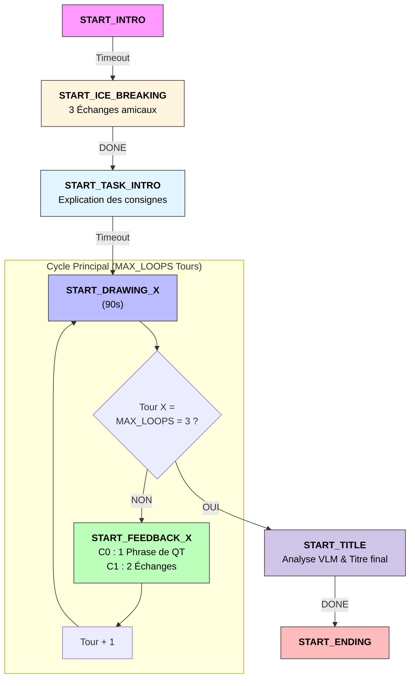

# Projet Hyppolite — Orchestration TCT-DP & IA Générative

> QTrobot V1 (ROS 1 Kinetic) transformé en compagnon social intelligent. L'intelligence, la vision et l'audition sont déportées sur PC (ROS 2) pour une réactivité maximale.

---

## Architecture du système

Pour garantir une interaction fluide, tous les capteurs (micro, caméra) sont branchés directement sur le PC. La Gateway ne sert plus qu'à envoyer les commandes motrices et vocales au robot.

```
┌────────────────────────────────────────────────────────────────┐
│                          PC (ROS 2)                            │
│  orchestator_node                                              │
|         ↓                                                      │
│ interaction_node → vision_node      ←  [Caméra USB]            |
|                 ou vision_node_temp ←  [Caméra Ecran HDMI]     |
|                  → stt_node         ←  [Micro USB]             |     
|                  → projection_node  ←  [Projecteur HDMI]       | 
|                  → brain_node       ←  [ChatGPT]               |
|                                                                |
|                         ↓↑                                     |
│                    gateway_node                                │
└──────────────────────────┬─────────────────────────────────────┘
                           │ WebSocket (rosbridge :9090)
┌──────────────────────────┴─────────────────────────────────────┐
│                   QTRobot (ROS 1)                              │
│                                                                │
│      Moteurs (Gestes)  ·  Écran (Émotions)  ·  TTS (Parole)    │
└────────────────────────────────────────────────────────────────┘
```

| Couche | Node | Rôle |
|---|---|---|
| Logique | `orchestrator_node` | Machine à états — 5 phases TCT-DP |
| Dispatcher | `interaction_node` | Traduit les phases en actions et en gestes / émotions / paroles |
| Audition | `stt_node` | Capture micro local +  STT local (Faster-Whisper)|
| Vision | `vision_node` | Flux local via caméra USB externe |
| Vision démo | `vision_node_temp` | Mode Science Infuse : Capture l'écran HDMI (via mss) au lieu de la caméra |
| Cognition | `brain_node` | llm : analyse le texte et image, choisit les actions et les images |
| Projection | `projection_node` | Affiche le visuel du dessin sur le projecteur HDMI |
| Passerelle | `gateway_node` | Bridge bi-directionnel ROS 1 ↔ ROS 2 |

---

## Connexion et configuration

### Accès au robot

```bash
# SSH
ssh qtrobot@192.168.100.1

# Interface web (autostart des services)
http://192.168.100.1:8080
http://192.168.100.2:8080
```

### Workflow de développement

Pour accéder directement aux fichiers du robot et/ou coder directement dans le robot.

```bash
sftp://qtrobot@192.168.100.1/
```

---

## Installation

### Sur le PC - ROS 2 Humble / Python 3.10

#### Dépendances

```bash
# Python
pip install roslibpy openai==0.28 rclpy opencv-python numpy faster-whisper pyaudio deepfilternet mss
```

#### Configuration du Micro 

Pour que le stt_node fonctionne, votre microphone USB doit être défini comme périphérique par défaut sur le système Linux.

Listez vos sources : ```pactl list short sources```

Définissez la source audio par défaut avec la commande suivante (remplacez la partie entre guillemets par le nom de votre périphérique trouvé) :

```bash
pactl set-default-source ”NOM_DU_PERIPHERIQUE”
```

## Mise en route

### 1. Côté robot - ROS 1

Activer dans l'autostart ros_bridge et motor :
- *start_qt_rosbridge.sh*
- *start_qt_motor.sh*

### 2. Côté PC - ROS 2

#### Première méthode de lancement

L'expérience se lance désormais en deux temps pour garantir que l'utilisateur garde le contrôle clavier sur l'orchestration.

Terminal 1 : Lancement de l'infrastructure (Launch File)

```bash
# Ce fichier lance la Gateway, la Vision normal ou temp (à modifier dans le launch), le STT, la Projection, le Brain et le nœud d'Interaction.
ros2 launch crearobot_brain launch.py
```

Terminal 2 : Pilote de l'expérience

```bash
# À lancer une fois que le Terminal 1 affiche que tous les noeuds se sont bien lancés sans erreur.
ros2 run crearobot_brain orchestrator
```

#### Seconde méthode de lancement 
Lancer tous les noeuds indépendemment :

```bash
# Interaction : Gère les phases, activation des nodes 
ros2 run crearobot_brain interaction

# Orchestrateur de l'expérience
ros2 run crearobot_brain orchestrator

# Cerveau LLM 
ros2 run crearobot_brain brain

# La passerelle de commande
ros2 run crearobot_brain gateway

# Le système de projection
ros2 run crearobot_brain projection

# L'audition (micro local)
ros2 run crearobot_brain stt

# La vision (caméra locale) ou Mode science Infuse
ros2 run crearobot_brain vision
ros2 run crearobot_brain vision_temp 
```

---

## Structure de l'expérience




### Détail des phases

| Phase | Commande | Description |
|---|---|---|
| Introduction | `START_INTRO` | Accueil du participant |
| Dessin (×3) | `START_DRAWING_X` | 180s de dessin, tête inclinée (Pitch 20) |
| Feedback (×2) | `START_FEEDBACK_X` | 4 échanges VLM + Chat, tête droite (Pitch 0) |
| Conclusion | `START_ENDING` | Fin de l'expérience |


## Fonctionnalités clés

### Synchronisation parfaite (lipsync)

La classe `TaskSynchronizer` (basée sur `asyncio`) déclenche simultanément :

- le geste (ROS Service)
- l'expression faciale (ROS Service)
- la parole (TTS)

Un correctif dynamique soustrait le temps de chargement de l'émotion à la durée d'animation de la bouche pour éviter qu'elle ne bouge dans le vide après la fin de la parole.

### Vision & projection

Le `camera_node` récupère un flux local à 60 FPS sans saturer le WiFi. Le `projection_node` utilise OpenCV pour mapper une fenêtre plein écran sur la sortie HDMI du projecteur, permettant à QT d'afficher la suggestion du dessin pour la conodition C2.

### Audition déportée - STT

#### Type de STT

Le nœud stt_node embarque Faster-Whisper en local (modèle Base). Cela permet de supprimer la latence réseau.
Pour garantir une interaction cohérente, le nœud d'audition n'est plus en "écoute libre" permanente. Il est désormais piloté par le topic /pc/stt/enable (Bool).

#### Verrouillage micro (Half-Duplex)

Pour éviter que QT ne s'écoute parler et ne génère des réponses infinies avec l'IA, un système de verrouillage Half-Duplex est implémenté :
- Dès que QT commence une phrase, le flag is_busy passe à True.
- Le micro est instantanément coupé (set_stt(False)).
- Le micro n'est réactivé qu'une fois la durée théorique de la phrase écoulée (calculée dynamiquement selon la longueur du texte).

### Intelligence artificielle — LLM

- **Analyse Multimodale** : Utilisation de GPT-4o-mini pour croiser les données visuelles (évolution du dessin) et les transcriptions auditives (STT).

- **Mémoire Cumulative** : Le système maintient une "mémoire visuelle" textuelle qui s'enrichit à chaque analyse d'image, permettant au robot de comprendre la progression du dessin sans re-traiter l'intégralité des pixels.

### Mouvements de tête dynamique

#### Engagement social et attention conjointe

Afin de renforcer l'engagement social, QT adapte sa posture :

- **Phase Dessin** : QT incline la tête vers le bas (HeadPitch) pour simuler une attention conjointe sur la feuille.

- **Phase Feedback** : QT redresse la tête pour établir un contact visuel avec l'utilisateur pendant la discussion.

#### Contrôle des Actuateurs

Le contrôle des moteurs est géré via le topic /qt_robot/head_position/command.

L'angle de Pitch (inclinaison) est modulé en fonction des phases de la machine à états (orchestrator_node).

Une valeur de 20.0 est utilisée pour le regard vers le bas (dessin) et 0.0 pour le regard horizontal (interaction).

---

## Tests

### Dans le fichier tests

| Fichier | Description |
|---|---|
| `client_bridge.py` | Test de la gateway, communication entre le robot et le pc |
| `test_gpt.py` | Validation du format JSON et du respect des listes de gestes |
| `bridge_client_cam.py` | Affichage du flux vidéo du robot en temps réel sur la tablette du robot |

---

## Sources

- [Documentation officielle QTrobot](https://docs.luxai.com/docs/intro_code)
- [Wiki ROS QTrobot](https://wiki.ros.org/Robots/qtrobot)

---

*Développé par Marco G.*

