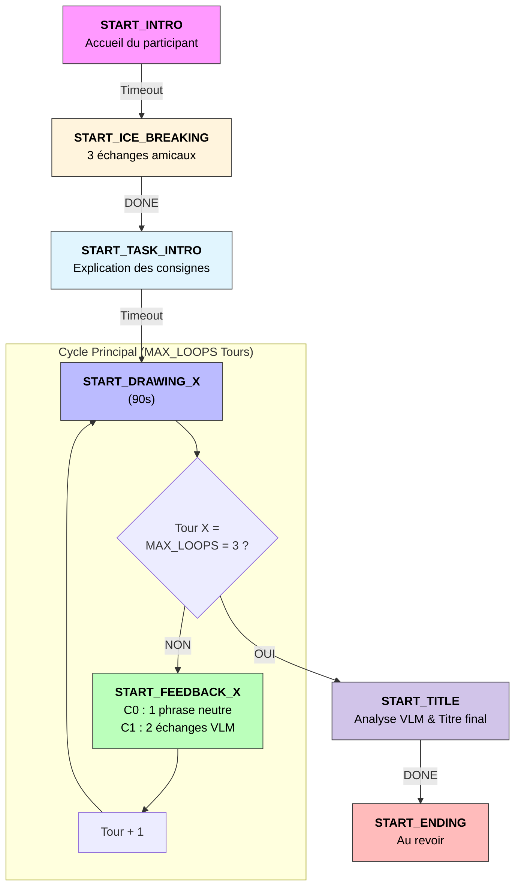

# Projet Hyppolite — Orchestration TCT-DP & IA Générative

> QTrobot V1 (ROS 1 Kinetic) transformé en compagnon social intelligent. L'intelligence, la vision et l'audition sont déportées sur PC (ROS 2) pour une réactivité maximale.

---

## Architecture du système

Pour garantir une interaction fluide, tous les capteurs (micro, caméra) sont branchés directement sur le PC. La Gateway ne sert plus qu'à envoyer les commandes motrices et vocales au robot.


| Couche | Node | Rôle |
|---|---|---|
| Logique | `orchestrator_node` | Machine à états — 7 phases TCT-DP |
| Dispatcher | `interaction_node` | Traduit les phases en actions (gestes / émotions / parole) |
| Audition | `stt_node` | Capture micro local + STT local (Faster-Whisper) |
| Vision | `vision_node` | Flux local via caméra USB externe |
| Vision démo | `vision_node_temp` | Mode Science Infuse : capture d'écran HDMI (via mss) |
| Cognition | `brain_node` | LLM/VLM : analyse texte et image, génère les réponses |
| Projection | `projection_node` | Affiche le visuel du dessin sur le projecteur HDMI (C2) |
| Passerelle | `gateway_node` | Bridge ROS 1 ↔ ROS 2 via WebSocket (rosbridge :9090) |

---

## Connexion et configuration

### Accès au robot

```bash
# SSH
ssh qtrobot@192.168.100.1

# Interface web (autostart des services)
http://192.168.100.1:8080
http://192.168.100.2:8080
```

### Workflow de développement

Pour accéder directement aux fichiers du robot et/ou coder directement dans le robot.

```bash
sftp://qtrobot@192.168.100.1/
```

---

## Installation

### Sur le PC - ROS 2 Humble / Python 3.10

#### Dépendances

```bash
pip install roslibpy openai==0.28 rclpy opencv-python numpy faster-whisper pyaudio deepfilternet mss
```

#### Configuration du Micro

Pour que le stt_node fonctionne, votre microphone USB doit être défini comme périphérique par défaut.

Listez vos sources : `pactl list short sources`

```bash
pactl set-default-source "NOM_DU_PERIPHERIQUE"
```

---

## Mise en route

### 1. Côté robot - ROS 1

Activer dans l'autostart ros_bridge et motor :
- *start_qt_rosbridge.sh*
- *start_qt_motor.sh*

### 2. Côté PC - ROS 2

#### Méthode principale (recommandée)

Terminal 1 — Infrastructure :

```bash
ros2 launch crearobot_brain launch.py
```

Terminal 2 — Pilote de l'expérience :

```bash
ros2 run crearobot_brain orchestrator
```

#### Méthode alternative (noeuds séparés)

```bash
ros2 run crearobot_brain interaction
ros2 run crearobot_brain orchestrator
ros2 run crearobot_brain brain
ros2 run crearobot_brain gateway
ros2 run crearobot_brain projection
ros2 run crearobot_brain stt
ros2 run crearobot_brain vision        # caméra USB
ros2 run crearobot_brain vision_temp   # capture écran HDMI
```

---

## Structure de l'expérience



### Détail des phases

| Phase | Commande | Description |
|---|---|---|
| Introduction | `START_INTRO` | Accueil du participant, présentation du robot |
| Ice Breaking | `START_ICE_BREAKING` | 3 échanges amicaux pilotés par le LLM |
| Consignes | `START_TASK_INTRO` | Explication de l'activité TCT-DP |
| Dessin (×3) | `START_DRAWING_X` | 90s de dessin, tête inclinée vers le dessin (Pitch 20) |
| Feedback (×2) | `START_FEEDBACK_X` | C0 : phrase neutre / C1 : 2 échanges VLM + Chat |
| Titre | `START_TITLE` | Analyse VLM finale, génération d'un titre pour le dessin |
| Conclusion | `START_ENDING` | Au revoir et fin de l'expérience |

---

## Fonctionnalités clés

### Synchronisation parfaite (lipsync)

La classe `TaskSynchronizer` (basée sur `asyncio`) déclenche simultanément :
- le geste (ROS Service)
- l'expression faciale (ROS Service)
- la parole (TTS)

Un correctif dynamique soustrait le temps de chargement de l'émotion à la durée d'animation de la bouche.

### Vision & projection

Le `vision_node` récupère un flux local via caméra USB. Le `projection_node` utilise OpenCV pour mapper une fenêtre plein écran sur la sortie HDMI du projecteur (condition C2).

### Audition déportée - STT

Le nœud `stt_node` embarque Faster-Whisper en local (modèle Base). Il est piloté par le topic `/pc/stt/enable` (Bool).

#### Verrouillage micro (Half-Duplex)

Pour éviter que QT ne s'écoute parler :
- Dès que QT commence une phrase, `is_busy` passe à `True`
- Le micro est coupé (`set_stt(False)`)
- Il n'est réactivé qu'une fois la durée théorique de la phrase écoulée

### Intelligence artificielle : LLM/VLM

- **Analyse multimodale** : GPT-4o-mini croise données visuelles (dessin) et transcriptions STT
- **Mémoire cumulative** : description textuelle du dessin enrichie à chaque analyse, sans retraiter les pixels

### Mouvements de tête dynamiques

- **Phase Dessin** : tête inclinée vers le bas (HeadPitch = 20) - attention conjointe sur la feuille
- **Phase Feedback / Ice Breaking** : tête droite (HeadPitch = 0) - contact visuel avec le participant

---

## Tests

| Fichier | Description |
|---|---|
| `client_bridge.py` | Test de la gateway, communication robot ↔ PC |
| `test_gpt.py` | Validation du format JSON et du respect des listes de gestes/émotions |
| `bridge_client_cam.py` | Affichage du flux vidéo du robot en temps réel |
| `test_sound_treating.py` | Test du pipeline audio : capture micro + transcription Faster-Whisper |


---

## Stats

Les analyses portent sur les scores TCT-DP (Urban, 1991) collectés lors de la passation pilote (Science Infuse). Deux conditions sont comparées : **C0** (feedback neutre) et **C1** (feedback LLM/VLM). Les Adultes sont exclus de toutes les analyses (N=3, groupe déséquilibré).

### Normalisation

Tous les critères TCT-DP sont normalisés sur leur score maximum avant analyse :
`Cn, Cm, Ne, Cl, Cth, Pe /6` · `Bfd, Bfi, Hu /3` · `Uc_b, Uc_c, Uc_d /2`

Le score total normalisé est la somme des 12 critères normalisés → **max = 12**.

### Données

`scores_tctdp.csv` — colonnes : `Participant`, `Condition` (C0/C1), `Tranche_age`, 12 critères TCT-DP, `Total`.

| Tranche d'âge | C0 | C1 | Inclus |
|---|---|---|---|
| Enfant | 20 | 17 | ✓ |
| Jeune enfant | 5 | 5 | ✓ |
| Adolescent | 1 | 1 | ✓ |
| Adulte | 0 | 3 | ✗ |

Finalement, aucune analyse par tranche d'âge n'a pu être réalisée en raison d'effectifs trop faibles et déséquilibrés.

### Scripts (`stats/scripts/`)

| Script | Description |
|---|---|
| `t_test.py` | T-test de Welch C0 vs C1 sur le score total brut, retrait outliers |
| `criteres_scoring.py` | Cohen's d et moyennes normalisées par critère TCT-DP (C0 vs C1) |
| `analyse_criteres.py` | T-tests bilatéraux par critère normalisé + Cohen's d |
| `score_expert.py` | Analyse du score expert (Todd Lubart), note de créativité subjective |
| `pca_clustering.py` | ACP sur les 12 critères normalisés ; scree plot, espace PCA, contributions (cos²) |
| `clustering_criteres.py` | Clustering K-means (k=4) sur les critères ; profils créatifs A/B/C/D |

```bash
cd stats/scripts/
python3 nom_script.py
```

### Figures (`stats/figures/`)

| Fichier | Généré par |
|---|---|
| `ttest.png` | `t_test.py` |
| `criteres_scoring.png` | `criteres_scoring.py` |
| `criteres_cohens_d.png` | `analyse_criteres.py` |
| `score_expert.png` | `score_expert.py` |
| `pca_clustering.png` | `pca_clustering.py` |
| `clustering_criteres.png` | `clustering_criteres.py` |
| `clustering_validation.png` | `clustering_criteres.py` |
| `clustering_stability.png` | `clustering_criteres.py` |

---

## Sources

- [Documentation officielle QTrobot](https://docs.luxai.com/docs/intro_code)
- [Wiki ROS QTrobot](https://wiki.ros.org/Robots/qtrobot)

---

*Développé par Marco G.*
